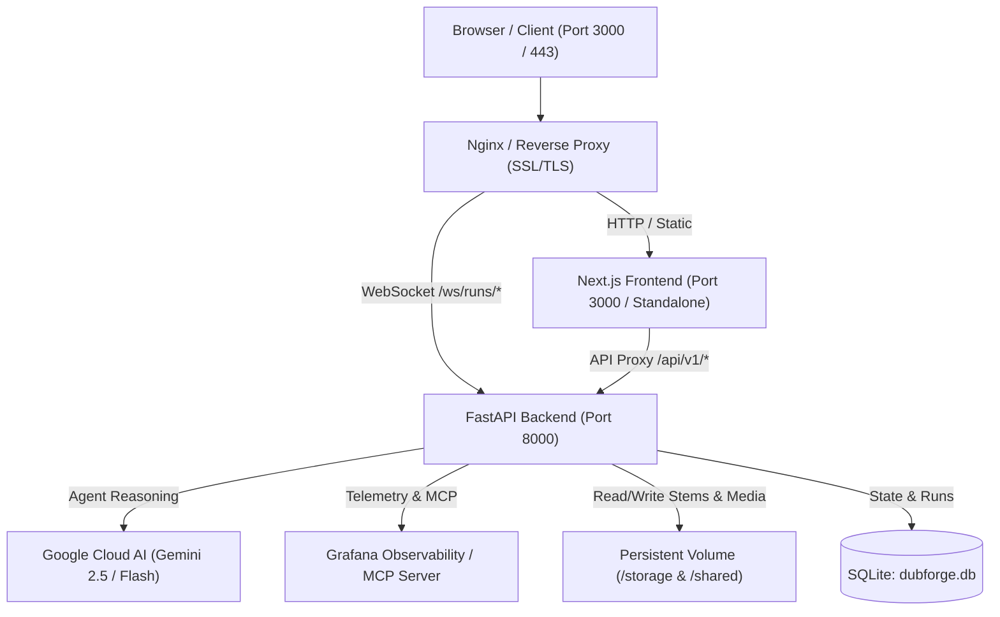

# LOCALIZE — Production Deployment Guide

This guide details how to build, containerize, and deploy the **LOCALIZE** (Autonomous AI Post-Production Crew for Film & Video Localization) platform in production environments.

---

## Architecture Overview



---

## 1. Quick Start: Docker Compose Deployment (Recommended)

### Prerequisites
- [Docker Engine](https://docs.docker.com/engine/install/) (>= 24.0)
- [Docker Compose](https://docs.docker.com/compose/) (>= 2.20)
- A valid Google AI Studio API key (`GEMINI_API_KEY`)

### Standard CPU Deployment

1. **Configure Environment Variables**:
   ```bash
   cp .env.example .env
   ```
   Edit `.env` and set your `GEMINI_API_KEY`:
   ```ini
   GEMINI_API_KEY=AIzaSy...
   ENVIRONMENT=production
   BACKEND_PORT=8000
   FRONTEND_PORT=3000
   CORS_ORIGINS=*
   ```

2. **Build and Launch the Stack**:
   ```bash
   docker compose up --build -d
   ```

3. **Verify Deployment Health**:
   ```bash
   # Check container status
   docker compose ps

   # Check backend health
   curl http://localhost:8000/health
   # Returns: {"status":"ok","app":"LOCALIZE Studio API","version":"1.0.0","environment":"production"}

   # View live logs
   docker compose logs -f
   ```

4. **Access the Application**:
   - **Studio Console UI**: `http://localhost:3000`
   - **Backend API & Swagger Docs**: `http://localhost:8000/docs`
   - **Telemetry Endpoint**: `http://localhost:8000/api/v1/telemetry/events`

---

### GPU Acceleration (NVIDIA CUDA)

For accelerated Demucs vocal separation and Whisper transcription with CUDA:

1. **Ensure NVIDIA Container Toolkit is installed** on host:
   ```bash
   nvidia-smi
   ```

2. **Launch with GPU Override**:
   ```bash
   docker compose -f docker-compose.yml -f docker-compose.gpu.yml up --build -d
   ```

---

## 2. Cloud VPS / Bare-Metal Deployment (Ubuntu / Debian)

### 1. System Dependencies & FFmpeg
```bash
sudo apt-get update && sudo apt-get install -y \
    python3.11 python3.11-venv python3-pip \
    nodejs npm \
    ffmpeg libsndfile1 build-essential curl git
```

### 2. Backend Setup
```bash
cd /opt/localize/backend
python3.11 -m venv .venv
source .venv/bin/activate
pip install --upgrade pip
pip install -r requirements.txt

# Test run
uvicorn app.main:app --host 0.0.0.0 --port 8000
```

### 3. Frontend Setup (Next.js Standalone)
```bash
cd /opt/localize/frontend
npm ci
npm run build

# Start standalone server
PORT=3000 node .next/standalone/server.js
```

---

## 3. Systemd Service Configuration

Create systemd unit files to automatically run and supervise services.

### Backend Service: `/etc/systemd/system/localize-backend.service`
```ini
[Unit]
Description=LOCALIZE FastAPI Backend Service
After=network.target

[Service]
Type=simple
User=ubuntu
WorkingDirectory=/opt/localize/backend
Environment="PATH=/opt/localize/backend/.venv/bin"
EnvironmentFile=/opt/localize/.env
ExecStart=/opt/localize/backend/.venv/bin/uvicorn app.main:app --host 0.0.0.0 --port 8000 --workers 4
Restart=always
RestartSec=5

[Install]
WantedBy=multi-user.target
```

### Frontend Service: `/etc/systemd/system/localize-frontend.service`
```ini
[Unit]
Description=LOCALIZE Next.js Frontend Service
After=network.target localize-backend.service

[Service]
Type=simple
User=ubuntu
WorkingDirectory=/opt/localize/frontend
Environment="NODE_ENV=production"
Environment="PORT=3000"
Environment="BACKEND_URL=http://127.0.0.1:8000"
EnvironmentFile=/opt/localize/.env
ExecStart=/usr/bin/node /opt/localize/frontend/.next/standalone/server.js
Restart=always
RestartSec=5

[Install]
WantedBy=multi-user.target
```

### Enable & Start Services
```bash
sudo systemctl daemon-reload
sudo systemctl enable --now localize-backend
sudo systemctl enable --now localize-frontend
```

---

## 4. Nginx Reverse Proxy with SSL (HTTPS & WSS)

Create `/etc/nginx/sites-available/localize`:

```nginx
server {
    listen 80;
    server_name studio.yourdomain.com;
    return 301 https://$host$request_uri;
}

server {
    listen 443 ssl http2;
    server_name studio.yourdomain.com;

    ssl_certificate /etc/letsencrypt/live/studio.yourdomain.com/fullchain.pem;
    ssl_certificate_key /etc/letsencrypt/live/studio.yourdomain.com/privkey.pem;

    client_max_body_size 500M;

    # Frontend application
    location / {
        proxy_pass http://127.0.0.1:3000;
        proxy_http_version 1.1;
        proxy_set_header Upgrade $http_upgrade;
        proxy_set_header Connection 'upgrade';
        proxy_set_header Host $host;
        proxy_cache_bypass $http_upgrade;
    }

    # Backend API endpoints
    location /api/v1/ {
        proxy_pass http://127.0.0.1:8000/api/v1/;
        proxy_http_version 1.1;
        proxy_set_header Host $host;
        proxy_set_header X-Real-IP $remote_addr;
        proxy_set_header X-Forwarded-For $proxy_add_x_forwarded_for;
        proxy_set_header X-Forwarded-Proto $scheme;
    }

    # WebSocket real-time progress feeds
    location /ws/ {
        proxy_pass http://127.0.0.1:8000/ws/;
        proxy_http_version 1.1;
        proxy_set_header Upgrade $http_upgrade;
        proxy_set_header Connection "Upgrade";
        proxy_set_header Host $host;
        proxy_read_timeout 86400s;
        proxy_send_timeout 86400s;
    }
}
```

Enable site and acquire SSL certificates:
```bash
sudo ln -s /etc/nginx/sites-available/localize /etc/nginx/sites-enabled/
sudo nginx -t
sudo systemctl reload nginx
sudo certbot --nginx -d studio.yourdomain.com
```

---

## 5. Environment Variables Reference

| Variable | Type | Default | Purpose |
|---|---|---|---|
| `GEMINI_API_KEY` | String (Required) | - | Google Cloud AI key powering multi-agent reasoning & translations |
| `ENVIRONMENT` | String | `production` | Environment mode (`production` or `development`) |
| `HOST` | String | `0.0.0.0` | Backend bind host address |
| `BACKEND_PORT` / `PORT` | Integer | `8000` | Backend HTTP/WebSocket port |
| `FRONTEND_PORT` | Integer | `3000` | Next.js frontend port |
| `CORS_ORIGINS` | String | `*` | Allowed CORS origins (e.g. `https://studio.domain.com,http://localhost:3000`) |
| `BACKEND_URL` | String | `http://backend:8000` | Target URL for Next.js API rewrite proxy |
| `NEXT_PUBLIC_WS_URL` | String | `""` | Optional explicit WebSocket base URL (e.g. `wss://studio.domain.com`) |
| `DB_PATH` | Path | `./storage/dubforge.db` | SQLite database file location |
| `STORAGE_DIR` | Path | `./storage` | Directory storing video files, audio stems, and subtitle artifacts |
| `GPU_VRAM_MB` | Integer | `4096` | Available GPU VRAM allocated for ML inference |

---

## 6. Verification & Health Monitoring

1. **Verify Backend Health**:
   ```bash
   curl -I http://localhost:8000/health
   ```
2. **Verify Swagger API Docs**:
   Visit `http://your-host:8000/docs`
3. **Verify Prometheus Metrics Exposition**:
   ```bash
   curl http://localhost:8000/api/v1/telemetry/metrics
   ```
4. **Verify Storage Permissions**:
   Ensure `storage/` and `shared/` directories are writable by the container/service user (`chmod -R 775 storage shared`).
