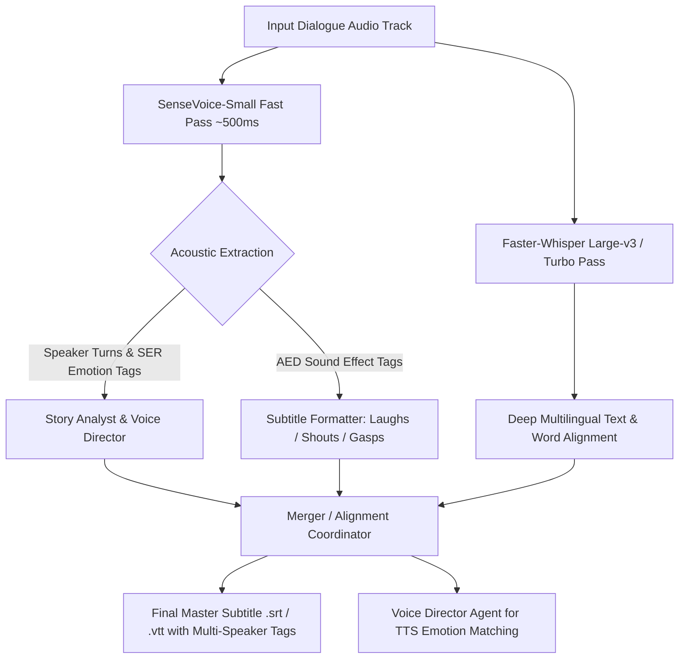

# SenseVoice-Small (FunASR) + Faster-Whisper Hybrid Integration Architecture

## 1. Executive Summary & Problem Statement

Standard single-stream ASR engines like Faster-Whisper (`large-v3`, `large-v3-turbo`) process audio sequentially as a single text stream. In dense film dialogue, fast multi-character banter, and emotional scenes, this leads to two major bottlenecks:
1. **Dialogue Dropout & Crosstalk Collapsing**: Overlapping multi-character speech is compressed or partially dropped.
2. **Missing Acoustic & Emotional Context**: Standard Whisper provides raw text without acoustic event tags (laughs, cries, gasps, applause) or emotional indicators (angry, fearful, happy), forcing downstream agents (`StoryAnalystAgent`, `VoiceDirectorAgent`) to guess emotional delivery strictly from text context via LLM prompting.

Integrating **Alibaba FunASR SenseVoice-Small** alongside Faster-Whisper creates a high-leverage hybrid transcription and acoustic feature extraction pipeline.

---

## 2. SenseVoice-Small vs Faster-Whisper Comparison

| Feature | Faster-Whisper (`large-v3-turbo`) | SenseVoice-Small (FunASR) | Hybrid Pipeline (Whisper + SenseVoice) |
| :--- | :--- | :--- | :--- |
| **Inference Speed** | 4x – 8x Real-Time | **15x – 25x Real-Time** (~1s for 30s) | Instant preliminary transcript & audio tags |
| **VRAM Footprint** | ~1.3 GB (int8) | **~500 MB – 800 MB** (ONNX/int8) | Fits within 4GB VRAM (GTX 1050 Ti) |
| **Acoustic Event Detection (AED)** | None | Emits `<\|LAUGHTER\|>`, `<\|APPLAUSE\|>`, `<\|CRY\|>`, `<\|COUGH\|>`, `<\|SNEEZE\|>` | Broadcast subtitle reaction injection |
| **Speech Emotion Recognition (SER)**| None | Emits `<\|HAPPY\|>`, `<\|SAD\|>`, `<\|ANGRY\|>`, `<\|FEARFUL\|>`, `<\|NEUTRAL\|>` | Direct acoustic input to Voice Director |
| **Language Coverage** | 99+ Languages | Primary: EN, ZH, JA, KO, Cantonese | Fast track for EN/Asian; Whisper fallback |

---

## 3. High-Leverage Architecture & Data Flow



---

## 4. Key Implementation Upgrades

### A. Rich Broadcast Subtitle Formatting (Mode C)
SenseVoice tags are parsed in `subtitle_formatter.py` to produce television/festival-ready subtitle tracks:
```srt
1
00:00:02,100 --> 00:00:04,350
- [Laughs] What were you thinking?
- Stop pushing me!

2
00:00:04,500 --> 00:00:07,100
- [Gasps] Did you hear that sound?
```

### B. Acoustic-Guided Voice Direction (Mode A & B)
Currently, `StoryAnalystAgent` prompts `qwen2.5:3b` to infer emotion from dialogue syntax. SenseVoice provides ground-truth acoustic emotions directly from actor audio:
* `<|ANGRY|>` $\rightarrow$ Configures Kokoro / Edge-TTS with increased pitch range and volume dynamics.
* `<|FEARFUL|>` / `<|SAD|>` $\rightarrow$ Configures softer formant synthesis and slower pacing.

### C. Language Adaptive Routing
* **Fast Path (`en`, `zh`, `ja`, `ko`)**: Run SenseVoice in ultra-fast mode (<5 seconds total for a 35s scene).
* **Broad Multilingual (`es`, `hi`, `fr`, `de`, etc.)**: Seamlessly fall back to Faster-Whisper `large-v3-turbo`.

---

## 5. Hardware Feasibility & Integration Blueprint

* **Model Weights**: ~234M parameters (~460MB weights).
* **Execution**: PyTorch / ONNX Runtime via `funasr` library.
* **GPU Memory**: Sequentially loaded and unloaded in `server_coordinator.py` / `TranscriptionStage` with `torch.cuda.empty_cache()` to maintain strict 4GB VRAM compliance on NVIDIA GTX 1050 Ti.
