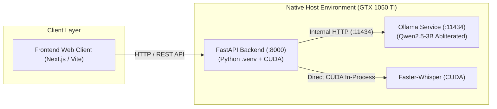

# Changes in Server Setup: Native Host Execution (Backend + Ollama)

## 1. Overview & Architecture Decision

To maximize performance, minimize latency, and ensure direct access to the **NVIDIA GTX 1050 Ti (4GB VRAM)**, both the **LocalizeAi Backend** and **Ollama LLM Engine** run in **Native Mode** directly on the host operating system (Windows/Linux) rather than inside virtualized Docker containers.



---

## 2. Key Changes & Requirements

| Component | Execution Mode | Port / Endpoint | GPU / VRAM Access |
| :--- | :--- | :--- | :--- |
| **FastAPI Backend** | **Native** (Python Virtualenv) | `http://localhost:8000` | Direct CUDA access for Faster-Whisper & Torch |
| **Ollama Service** | **Native** (Windows Application) | `http://localhost:11434` | Direct GPU offload for Qwen2.5-3B (~2.1 GB VRAM) |
| **Frontend Client** | **Native / Dev Server** | `http://localhost:3000` (or `5173`) | Calls Backend API at `http://localhost:8000` |

---

## 3. Client & Host Readiness Checklist

Before launching jobs from the frontend or API client, ensure the following services are running:

### Step 1: Ensure Ollama is Running
Ollama runs in the Windows system tray or via terminal:
```powershell
# Verify Ollama is running and model is downloaded
ollama list
# Expected to see: richardyoung/qwen2.5-3b-instruct-abliterated or qwen2.5:3b
```
If Ollama is not active, launch it or run:
```powershell
ollama serve
```

### Step 2: Launch Backend in Native Virtual Environment
```powershell
# Navigate to project root
cd "d:\Games\Hckthons\Side Projects\LocalizeAi"

# Activate Python Virtual Environment
.\.venv\Scripts\Activate.ps1

# Start FastAPI backend server
uvicorn app.main:app --app-dir backend --host 0.0.0.0 --port 8000 --reload
```

### Step 3: Client API Configuration
Your frontend client should configure its API base URL:
```env
NEXT_PUBLIC_API_URL=http://localhost:8000
# or
VITE_API_BASE_URL=http://localhost:8000
```

---

## 4. Sequential Memory Safety Protocol (GTX 1050 Ti 4GB Cap)

Because the GPU has **4GB VRAM**:
1. **Stage 1 (Transcription):** Faster-Whisper loads and consumes ~1.5 GB VRAM.
2. **Stage 2 (Subtitle Polish & Translation):** Ollama is called via `http://localhost:11434/api/generate`. Qwen2.5-3B occupies ~2.1 GB VRAM.
3. **Stage 3 (Voice Synthesis & Alignment):** TTS (Edge-TTS / XTTS) generates the dubbed audio.

Running natively avoids Docker container overhead and gives both engines maximum memory efficiency.
