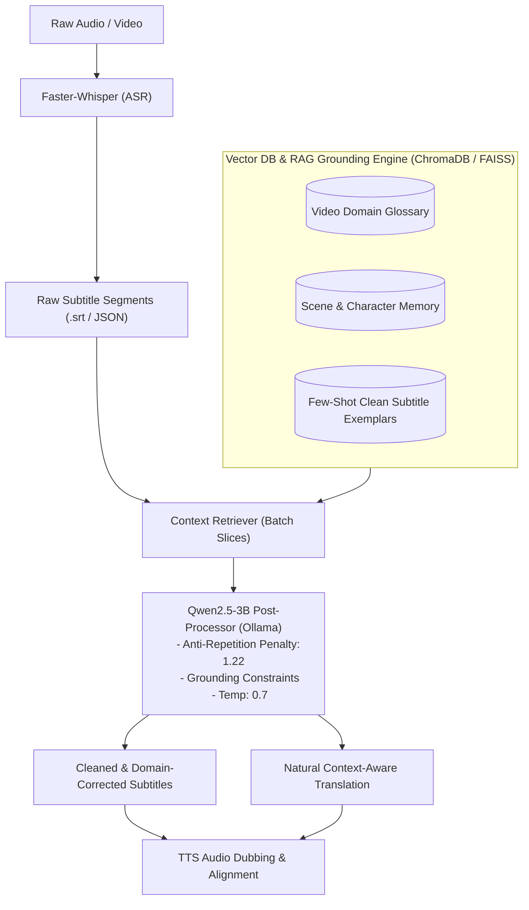

# Subtitle Quality Enhancement Pipeline: Faster-Whisper + Qwen2.5-3B Post-Processing

## 1. Executive Summary & Objective

In media translation and automated dubbing pipelines (such as **LocalizeAi**), raw Automatic Speech Recognition (ASR) generated by **Faster-Whisper** provides accurate timestamps and acoustic phonetic capture. However, raw ASR transcripts frequently suffer from:
1. **Misheard Technical Jargon & Acronyms:** (e.g., *"n8n"* transcribed as *"and eight and"*, *"FastAPI"* as *"fast api"*).
2. **Missing / Erroneous Punctuation:** Run-on sentences, awkward comma placement, and missing question marks.
3. **Speech Disfluencies:** *"Um"*, *"uh"*, stutters, false starts, and duplicate words.
4. **Sub-optimal Translation Quality:** Standard word-for-word machine translation sounds robotic, lacks idiomatic tone, and ignores timing constraints.

### The Solution
Implement a post-processing stage using **Qwen2.5-3B** (specifically `qwen2.5-3b-instruct-abliterated` or custom fine-tuned `qwen2.5-3b-cinematic`) reinforced by **Vector DB (RAG) Grounding** and **Anti-Hallucination Sampling Parameters** running locally via Ollama / GGUF to refine, format, and translate Whisper-generated subtitles prior to TTS synthesis and dubbing.

---

## 2. End-to-End Pipeline Architecture with RAG & Vector DB



---

## 3. Hardware Footprint & Optimization (GTX 1050 Ti - 4GB VRAM)

| Component | VRAM Requirement | Execution Strategy |
| :--- | :--- | :--- |
| **Faster-Whisper (`small` / `medium`)** | ~1.5 GB – 2.2 GB | Runs during Stage 1 (ASR) |
| **Qwen2.5-3B (`Q4_K_M` / `Q5_K_M`)** | ~2.1 GB – 2.4 GB | Runs during Stage 2 (Post-process / Translation) |
| **Vector DB (ChromaDB / In-Memory FAISS)** | ~50 MB – 100 MB RAM | Runs purely in CPU System RAM (negligible footprint) |
| **Sequential Memory Model** | Peak ~2.5 GB | Unload Whisper from VRAM before loading Qwen, or run sequentially via Ollama |

* **Speed on GTX 1050 Ti:** ~30 to 45 tokens/second.
* **Context Budget:** Up to 8k tokens comfortably fitted in 4GB VRAM without swapping to CPU/system RAM.

---

## 4. Why Qwen2.5-3B (Abliterated / Dolphin) Over Other Models?

1. **Top Tier Multilingual & Grammar Scoring:** Qwen 2.5 outperforms Llama-3.2-3B and Phi-3.5-mini in technical vocabulary retention, Hindi/European translation fluency, and structured JSON generation.
2. **Zero Refusals & Censorship Resilience:** Standard aligned models frequently refuse to process transcripts containing profanity, aggressive dialogue, medical terms, or controversial topics. The **abliterated / Dolphin** version processes all transcripts verbatim without dropping lines or adding moral disclaimers.
3. **Strict Formatting Discipline:** Follows segment index retention and JSON formatting instructions with high fidelity.

---

## 5. Preventing 3B Hallucinations, Repetition Loops & Degeneracy

Small 3B models have narrower attention capacity. When running open-ended text without tight constraints, self-attention can boost generated phrases recursively, causing infinite loops (e.g. repeating the same dialogue over and over) or hallucinating new characters.

### A. Core Mitigation Rules
1. **Sliding Window Chunking:** Never pass more than **8 to 12 subtitle segments** in a single prompt.
2. **Strict Negative Grounding:** Explicitly instruct the model that it is a *proofreader*, not a story author, and forbid adding new dialogue.
3. **Optimized Sampling Parameters:** Increase repetition penalty and lower temperature.

### B. Custom Ollama `Modelfile` (Anti-Loop Tuned)

```dockerfile
FROM richardyoung/qwen2.5-3b-instruct-abliterated

# Anti-repetition & stability parameters
PARAMETER repeat_penalty 1.22
PARAMETER repeat_last_n 128
PARAMETER temperature 0.70
PARAMETER top_p 0.90
PARAMETER top_k 40

# Negative constraints & strict persona
SYSTEM """You are a deterministic subtitle correction and translation engine.
Strict Rules:
1. You must ONLY edit the exact text provided in the input segments.
2. NEVER invent new characters, scenes, actions, or dialogue.
3. NEVER repeat phrases or loop sentences.
4. Maintain exact line counts and segment IDs."""
```

Build and run with:
```powershell
ollama create qwen-sub-cleaner -f Modelfile
ollama run qwen-sub-cleaner
```

---

## 6. Vector DB & RAG Knowledge Grounding Strategy

Integrating a lightweight Vector DB (e.g. **ChromaDB**, **Qdrant**, or **FAISS**) in the backend prevents hallucinations and ensures domain accuracy through three retrieval layers:

### 1. Domain & Technical Term Glossary RAG
* **Mechanism:** Extract technical terms, character names, APIs, and proper nouns from video metadata, description, or reference documentation and embed them into the Vector DB.
* **Prompt Injection:** When cleaning a chunk, retrieve the top 3–5 matching glossary terms (e.g., *"n8n Webhook Node"*, *"Twitter API v2"*, *"OAuth 1.0a"*) and inject them into the system prompt.

### 2. Scene & Speaker Continuity Memory
* **Mechanism:** Store summaries of preceding scenes in the Vector DB.
* **Benefit:** When processing segment #80, the model receives context on who is currently speaking and the topic of discussion, preventing context drift across long videos.

### 3. Dynamic Few-Shot Exemplar Retrieval
* **Mechanism:** Store a library of 20+ `(Raw Whisper Output -> Corrected Subtitle)` pairs in the Vector DB.
* **Benefit:** Dynamically fetch the 2 most semantically similar examples into the prompt so the 3B model adheres strictly to the desired style and syntax.

---

## 7. Post-Processing Prompt Templates

### A. Subtitle Cleanup & Technical Term Correction (Source Language)

```text
System: You are an expert subtitle editor. Clean the raw ASR transcription while preserving exact meaning and timing order.

Retrieved Video Glossary:
- "n8n" (automation platform)
- "FastAPI" (Python web framework)
- "Twitter API v2"

Rules:
1. Correct misheard technical terms using the provided glossary and context clues.
2. Fix punctuation, sentence boundaries, and capitalization.
3. Remove speech disfluencies (um, uh, stuttering, repeated words).
4. Do NOT invent new dialogue or add extra lines.
5. Return ONLY a valid JSON array matching the input format.

Input:
[
  {"id": 1, "start": 0.0, "end": 4.2, "text": "so basicly today we are gonna build a automation using and eight and"},
  {"id": 2, "start": 4.5, "end": 8.0, "text": "and connect it to fast api for the local server um yeah"}
]

Output:
[
  {"id": 1, "start": 0.0, "end": 4.2, "text": "So basically, today we are going to build an automation using n8n,"},
  {"id": 2, "start": 4.5, "end": 8.0, "text": "and connect it to FastAPI for the local server."}
]
```

### B. Natural Translation & Lip-Sync Fitting (Target Language)

```text
System: You are a professional media localization and dubbing translator.
Translate the following English subtitles into natural, conversational {TARGET_LANGUAGE}.

Rules:
1. Match the spoken cadence and length of the source segment for dubbing alignment.
2. Adapt idioms and colloquial speech naturally rather than literal translation.
3. Maintain technical terms where industry-standard.
4. Output ONLY the translated JSON array.
```

---

## 8. Integration Steps in LocalizeAi Backend

1. **Stage 1 (ASR):** Extract audio, transcribe with `faster-whisper` to generate initial segment list with timestamps (`start`, `end`, `text`).
2. **Stage 2 (RAG Retrieval):** Vector DB queries top relevant glossary terms and scene context for the current segment batch.
3. **Stage 3 (Batch Post-Processing):** Pass sliding batches of 8–12 segments to `qwen-sub-cleaner` (Ollama at `http://localhost:11434/api/generate`).
4. **Stage 4 (TTS & Alignment):** Send the polished/translated text to the TTS engine (XTTS / Edge-TTS / Kokoro) for duration-aligned voice synthesis.

---

## 9. Ollama Deployment Commands

```powershell
# Pull and run the recommended abliterated 3B model
ollama run richardyoung/qwen2.5-3b-instruct-abliterated

# Or build the custom anti-hallucination model
ollama create qwen-sub-cleaner -f Modelfile
ollama run qwen-sub-cleaner
```

---

## 10. Fine-Tuning Qwen2.5-3B for Cinematic Subtitles & Story Translation (QLoRA)

Fine-tuning permanently bakes cinematic phrasing, context awareness, and zero-hallucination output directly into the model's neural weights.

### A. Dataset Sourcing & Preparation
You can build a high-performance training dataset by combining:
1. **Your existing 8,000-line Japanese $\rightarrow$ English dialogue dataset** (with scene/story context).
2. **Scraped/downloaded subtitles from popular fanfiction, anime, drama, and movies** (e.g. `.srt` and `.ass` dialogue pairs).

#### Optimal JSONL Training Schema (`dataset.jsonl`):
Group lines into 3–6 turn mini-scenes so the model learns dialogue continuity:

```json
{
  "conversations": [
    {
      "role": "system",
      "content": "You are a professional cinematic localization engine. Translate the source subtitle dialogue into natural, expressive English matching character tone."
    },
    {
      "role": "user",
      "content": "Scene Context: Hiroshi is cooking breakfast in the kitchen while Yuri just woke up.\n[\n  {\"id\": 1, \"speaker\": \"Hiroshi\", \"text\": \"おい、朝飯できたぞ。\"},\n  {\"id\": 2, \"speaker\": \"Yuri\", \"text\": \"ん…今行く。今日大事な日なんでしょ？\"}\n]"
    },
    {
      "role": "assistant",
      "content": "[\n  {\"id\": 1, \"speaker\": \"Hiroshi\", \"text\": \"Hey, breakfast is ready.\"},\n  {\"id\": 2, \"speaker\": \"Yuri\", \"text\": \"Mmm... coming. Big day ahead, right?\"}\n]"
    }
  ]
}
```

### B. Unsloth Fine-Tuning Script (Google Colab / Cloud GPU)

```python
# 1. Install Unsloth
!pip install --no-deps "xformers<0.0.29" "trl<0.9.0" peft accelerate bitsandbytes
!pip install "unsloth[colab-new] @ git+https://github.com/unslothai/unsloth.git"

# 2. Load Model & Setup 4-bit QLoRA
from unsloth import FastLanguageModel
import torch

model, tokenizer = FastLanguageModel.from_pretrained(
    model_name = "unsloth/Qwen2.5-3B-Instruct",
    max_seq_length = 2048,
    load_in_4bit = True,
)

model = FastLanguageModel.get_peft_model(
    model,
    r = 16,
    target_modules = ["q_proj", "k_proj", "v_proj", "o_proj", "gate_proj", "up_proj", "down_proj"],
    lora_alpha = 16,
    lora_dropout = 0,
    bias = "none",
)

# 3. Load JSONL & Train
from datasets import load_dataset
from trl import SFTTrainer
from transformers import TrainingArguments

dataset = load_dataset("json", data_files="dataset.jsonl", split="train")

trainer = SFTTrainer(
    model = model,
    tokenizer = tokenizer,
    train_dataset = dataset,
    dataset_text_field = "text",
    max_seq_length = 2048,
    args = TrainingArguments(
        per_device_train_batch_size = 2,
        gradient_accumulation_steps = 4,
        warmup_steps = 10,
        max_steps = 300,
        learning_rate = 2e-4,
        logging_steps = 10,
        optim = "adamw_8bit",
        output_dir = "outputs",
    ),
)
trainer.train()

# 4. Export Directly to GGUF (for GTX 1050 Ti)
model.save_pretrained_gguf("qwen2.5-3b-cinematic", tokenizer, quantization_method = "q4_k_m")
```

### C. Training Privacy & Platform Comparison

| Platform | Cost | Privacy / Safety Filters | Training Time (8,000 lines) |
| :--- | :--- | :--- | :--- |
| **Google Colab (T4 GPU)** | **100% Free** | Automated backend scans (malware/CSAM only). No human reads files. Ephemeral disk deleted upon disconnect. | **~15–20 minutes** |
| **RunPod / Vast.ai (RTX 3090)** | **~$0.10** ($0.20/hr) | **100% Private root SSH.** Zero scans or content filters. Ideal for uncensored/NSFW datasets. | **~8–10 minutes** |
| **Local PC (CPU + RAM)** | **Free** | **100% Offline.** Zero bytes leave your physical machine. | **~2–3 hours** |
