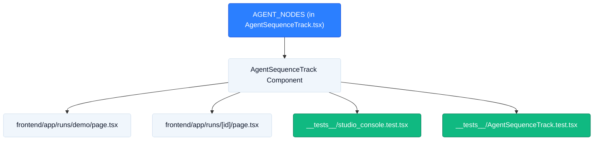

# TICKET-41: Voice Director Audio Invariant Metadata (`inv_005`)

## Status
- **State**: Completed
- **Primary Seam**: `frontend/components/studio/AgentSequenceTrack.tsx` (`AGENT_NODES` array)
- **Verification**: Vitest (`frontend/__tests__/AgentSequenceTrack.test.tsx`) — Passed (2/2)
- **Blocking Dependencies**: None (Unblocked)
- **Downstream Blocked**: None (TICKET-42 unblocked)

---

## CodeGraph: Dependency, Callers & Blast Radius Analysis



### 1. Traced Function Callers & Call Sites
- `AGENT_NODES` is consumed locally by `AgentSequenceTrack` at Line 323:
  - `displayNodes = projectMode === 'C' ? AGENT_NODES.filter(...) : AGENT_NODES;`
- Read by child `AgentCard` at Line 351 (`node.techStack`, `node.outputDesc`, `node.footerLeft`).

### 2. Blast Radius Assessment
- **Zero Runtime Breakage Risk**: Modifying `voice_director` inside `AGENT_NODES` is purely descriptive and static metadata.
- **Affected Tests**:
  - `frontend/__tests__/studio_console.test.tsx` (Verifies stage rendering)
  - `frontend/__tests__/AgentSequenceTrack.test.tsx` (Asserts `24kHz PCM_16` text)

### 3. Type Hierarchy & Seams
```typescript
// Defined in AgentSequenceTrack.tsx:9
export interface AgentNodeConfig {
  id: AgentName;
  stepNumber: string;
  stepLabel: string;
  role: string;
  techStack: string;       // ← 'Kokoro-82M / Edge-TTS Fallback'
  inputDesc: string;
  outputDesc: string;      // ← 'Raw Synthesized Speech Stems (.wav 24kHz PCM_16)'
  defaultLatency: number;
  row: 1 | 2;
  positionInRow: number;
  footerLeft?: string;     // ← '24kHz PCM_16'
  footerRight?: string;
}
```

### 4. Import / Export Graph
- **Imports Consumed**: `AgentName` from `../../lib/telemetry`
- **Exports Produced**: `AGENT_NODES` (consumed by `AgentSequenceTrack`)

---

## Target Seam & Exact Slices
- **File**: `frontend/components/studio/AgentSequenceTrack.tsx` (Lines ~84–96)

```typescript
{
  id: 'voice_director',
  stepNumber: '03',
  stepLabel: 'Voice Director',
  role: 'Neural Voice Casting & TTS Synthesis',
  techStack: 'Kokoro-82M / Edge-TTS Fallback',
  inputDesc: 'Adapted Dialogue Script + Speaker Timestamps',
  outputDesc: 'Raw Synthesized Speech Stems (.wav 24kHz PCM_16)',
  defaultLatency: 6840,
  row: 1,
  positionInRow: 2,
  footerLeft: '24kHz PCM_16',
  footerRight: '0 retries',
}
```

---

## Acceptance Criteria
1. `voice_director` node config displays `Kokoro-82M / Edge-TTS Fallback` as tech stack.
2. `voice_director` output description displays `.wav 24kHz PCM_16`.
3. `footerLeft` badge explicitly renders `24kHz PCM_16`.
4. Zero breaking changes to `AgentNodeConfig` interface or downstream props.
