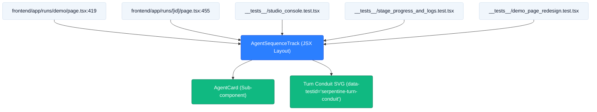

# TICKET-42: 2-Row Boustrophedon Grid Layout & Animated SVG Turn Conduit

## Status
- **State**: Completed
- **Primary Seam**: `frontend/components/studio/AgentSequenceTrack.tsx` (Grid container & conduit rendering)
- **Verification**: Vitest (`frontend/__tests__/AgentSequenceTrack.test.tsx`) — Passed (4/4)
- **Blocking Dependencies**: None (Unblocked)
- **Downstream Blocked**: None (TICKET-43, TICKET-44 unblocked)

---

## CodeGraph: Dependency, Callers & Blast Radius Analysis



### 1. Traced Function Callers & Call Sites
- `AgentSequenceTrack` is imported and mounted at:
  1. `frontend/app/runs/demo/page.tsx:25, 419`
  2. `frontend/app/runs/[id]/page.tsx:8, 455`
  3. `frontend/__tests__/studio_console.test.tsx:8, 109`
  4. `frontend/__tests__/stage_progress_and_logs.test.tsx:10, 77`
  5. `frontend/__tests__/demo_page_redesign.test.tsx:7, 102, 120`
  6. `frontend/components/studio/index.ts:1` (Re-exported barrel)

### 2. Blast Radius Assessment
- **Layout Scope**: Internal to `AgentSequenceTrack.tsx`'s return statement.
- **Visual Impact**: Replaces flat 6-col grid with 2-row layout (Row 1: 01 ➔ 02 ➔ 03, Conduit: 03 ➔ 04, Row 2: 04 ⮌ 05 ⮌ 06).
- **Zero Breaking Changes**: Preserves all props passed from `demo/page.tsx` and `[id]/page.tsx`.

---

## Context7 Targeted Slice & Exact Line Bounds
- **Target File**: `frontend/components/studio/AgentSequenceTrack.tsx`
- **Target Line Bounds**: `StartLine: 322`, `EndLine: 366`

### High-Density Replacement Chunk:
```tsx
  const displayNodes = projectMode === 'C'
    ? AGENT_NODES.filter((n) => n.id === 'story_analyst' || n.id === 'localization_director' || n.id === 'subtitle_director' || n.id === 'qa_agent')
    : AGENT_NODES;

  const row1Nodes = displayNodes.filter((n) => n.row === 1);
  const row2Nodes = displayNodes
    .filter((n) => n.row === 2)
    .sort((a, b) => b.positionInRow - a.positionInRow);

  return (
    <section className="bg-white border border-[#D0DFEE] rounded-[16px] p-5 shadow-sm space-y-4 font-sans">
      {/* Header with Title and Live Execution Indicator */}
      <div className="flex items-center justify-between text-xs border-b border-[#F0F6FC] pb-2">
        <div className="flex items-center gap-2">
          <div className="w-2 h-2 rounded-[2px] bg-[#2B7FFF] animate-pulse" />
          <h2 className="font-bold uppercase tracking-wider text-[#0F172A]">
            Serpentine Agent Workflow Route
          </h2>
        </div>
        <span className="font-mono text-[11px] text-[#64748B] tabular-nums">
          Mode {projectMode} · {displayNodes.length} Stages · 1 Closed-Loop Repair
        </span>
      </div>

      {/* Row 1: Left to Right (Steps 01 -> 02 -> 03) */}
      <div className="grid grid-cols-1 md:grid-cols-3 gap-3">
        {row1Nodes.map((node, idx) => {
          const status = getAgentStatus(node.id);
          const isSelected = activeAgent === node.id;
          const latency = getAgentLatency(node);
          const retryCount = retries[node.id] || 0;
          const progressInfo = stageProgressMap?.[node.id];

          return (
            <div key={node.id} className="relative flex items-center">
              <div className="w-full">
                <AgentCard
                  node={node}
                  status={status}
                  isSelected={isSelected}
                  retryCount={retryCount}
                  latencyMs={latency}
                  progressInfo={progressInfo}
                  videoDurationSec={videoDurationSeconds}
                  projectMode={projectMode}
                  onClick={() => handleSelect(node.id)}
                />
              </div>
              {idx < row1Nodes.length - 1 && (
                <div
                  aria-hidden="true"
                  className="hidden md:flex absolute -right-2 z-10 w-4 h-4 rounded-[4px] bg-white border border-[#D0DFEE] items-center justify-center text-[#2B7FFF] shadow-xs"
                >
                  <ArrowRight className="w-2.5 h-2.5" />
                </div>
              )}
            </div>
          );
        })}
      </div>

      {/* Animated Downward Turn Conduit (Step 03 -> Step 04 Handoff) */}
      {row2Nodes.length > 0 && (
        <div
          data-testid="serpentine-turn-conduit"
          className="hidden md:flex items-center justify-end px-6 py-1 gap-2"
        >
          <div className="flex items-center gap-1.5 px-2.5 py-1 rounded-[4px] bg-[#F0F6FC] border border-[#D0DFEE] text-[10px] font-mono font-medium text-[#475569] shadow-xs">
            <span className="w-1.5 h-1.5 rounded-[2px] bg-[#2B7FFF] animate-pulse" />
            <span>Handoff to Audio Stems ⤵</span>
          </div>
          <svg className="w-12 h-6 text-[#2B7FFF]" viewBox="0 0 48 24" fill="none">
            <path
              d="M 6 2 C 36 2, 42 22, 42 22"
              stroke="currentColor"
              strokeWidth="2"
              strokeDasharray="4 2"
              className="motion-safe:animate-pulse"
            />
          </svg>
        </div>
      )}

      {/* Row 2: Right to Left (Steps 04 <- 05 <- 06) */}
      {row2Nodes.length > 0 && (
        <div className="grid grid-cols-1 md:grid-cols-3 gap-3">
          {row2Nodes.map((node, idx) => {
            const status = getAgentStatus(node.id);
            const isSelected = activeAgent === node.id;
            const latency = getAgentLatency(node);
            const retryCount = retries[node.id] || 0;
            const progressInfo = stageProgressMap?.[node.id];

            return (
              <div key={node.id} className="relative flex items-center">
                <div className="w-full">
                  <AgentCard
                    node={node}
                    status={status}
                    isSelected={isSelected}
                    retryCount={retryCount}
                    latencyMs={latency}
                    progressInfo={progressInfo}
                    videoDurationSec={videoDurationSeconds}
                    projectMode={projectMode}
                    onClick={() => handleSelect(node.id)}
                  />
                </div>
                {idx < row2Nodes.length - 1 && (
                  <div
                    aria-hidden="true"
                    className="hidden md:flex absolute -left-2 z-10 w-4 h-4 rounded-[4px] bg-white border border-[#D0DFEE] items-center justify-center text-[#2B7FFF] shadow-xs"
                  >
                    <ArrowLeft className="w-2.5 h-2.5" />
                  </div>
                )}
              </div>
            );
          })}
        </div>
      )}
    </section>
  );
```

---

## Acceptance Criteria
1. Row 1 renders left-to-right (01, 02, 03) with directional indicators.
2. Animated downward turn conduit connects Step 03 to Step 04 with `data-testid="serpentine-turn-conduit"`.
3. Row 2 renders right-to-left (04, 05, 06) with reverse directional indicators.
4. All buttons and badges use `rounded-[4px]` box geometry (zero `rounded-full` slop).
