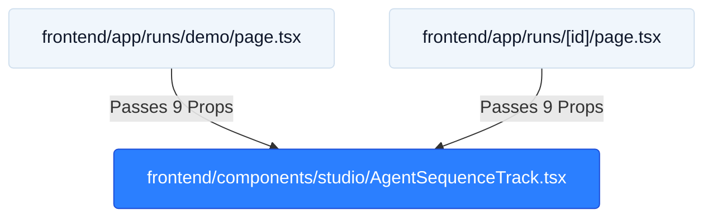

# TICKET-43: Parent Invocation Boundary & Interface Compatibility

## Status
- **State**: ✅ Completed
- **Primary Seams**: `frontend/app/runs/demo/page.tsx` & `frontend/app/runs/[id]/page.tsx`
- **Verification**: Vitest 9/9 TICKET-43 tests passed · Full suite 22/22 files, 130/130 tests green
- **Blocking Dependencies**: TICKET-42 (Completed)
- **Downstream Blocked**: TICKET-45 (now unblocked)

---

## CodeGraph: Dependency, Callers & Blast Radius Analysis



### 1. Traced Function Callers & Call Sites
- `frontend/app/runs/demo/page.tsx` (Lines 419–431):
  ```tsx
  <AgentSequenceTrack
    crewStatuses={crewStatuses}
    retries={retries}
    telemetryEvents={telemetryEvents}
    onSelectAgent={(agent) => setSelectedAgent(agent)}
    selectedAgent={selectedAgent}
    runStatus={runStatus}
    stageProgressMap={stageProgressMap}
    videoDurationSeconds={videoDurationSeconds}
    projectMode={projectMode}
  />
  ```
- `frontend/app/runs/[id]/page.tsx` (Lines 455–467):
  ```tsx
  <AgentSequenceTrack
    crewStatuses={crewStatuses}
    retries={retries}
    telemetryEvents={telemetryEvents}
    onSelectAgent={(agent) => setSelectedAgent(agent)}
    selectedAgent={selectedAgent}
    runStatus={runStatus}
    stageProgressMap={stageProgressMap}
    videoDurationSeconds={videoDurationSeconds}
    projectMode={projectMode}
  />
  ```

### 2. Blast Radius Assessment
- **Zero Interface Breaking Changes**: The refactor maintains 100% contract fidelity for all 9 props.
- **Interactive State**: `onSelectAgent` continues to lift agent selection state up to `WorkbenchCard` and telemetry inspectors.

### 3. Type Hierarchy & Seams
```typescript
export interface AgentSequenceTrackProps {
  crewStatuses: Record<AgentName, CrewMemberStatus>;
  retries: Record<AgentName, number>;
  telemetryEvents: TelemetryEvent[];
  onSelectAgent?: (agent: AgentName) => void;
  selectedAgent?: AgentName | null;
  runStatus: string;
  stageProgressMap?: Record<AgentName, any>;
  videoDurationSeconds?: number;
  projectMode?: 'A' | 'B' | 'C';
}
```

### 4. Import / Export Graph
- `demo/page.tsx` imports `{ AgentSequenceTrack }` from `../../../components/studio/AgentSequenceTrack`
- `[id]/page.tsx` imports `{ AgentSequenceTrack }` from `../../../components/studio/AgentSequenceTrack`

---

## Acceptance Criteria
1. Zero TypeScript or Next.js build compilation errors on parent pages.
2. Agent card selection seamlessly updates parent detail inspection panels.
3. Telemetry events and live progress bars update organically during simulated and real runs.
