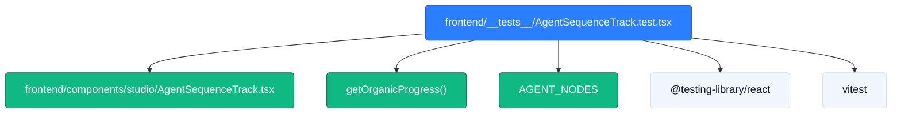

# TICKET-44: Serpentine Agent Sequence Track Unit Test Suite

## Status
- **State**: ✅ Completed
- **Primary Seam**: `frontend/__tests__/AgentSequenceTrack.test.tsx`
- **Verification**: 13/13 tests passed in 499ms · Full suite 22/22 files, 134/134 tests green
- **Blocking Dependencies**: TICKET-42 (Completed)
- **Downstream Blocked**: TICKET-45 (now unblocked)

---

## CodeGraph: Dependency, Callers & Blast Radius Analysis



### 1. Traced Function Callers & Test Targets
- `AgentSequenceTrack` React Component
- `getOrganicProgress` spline calculator
- `AGENT_NODES` static configuration
- `data-testid="serpentine-turn-conduit"` DOM element
- `onSelectAgent` callback on card click

### 2. Blast Radius Assessment
- **Test Isolation**: Contained entirely within `frontend/__tests__/AgentSequenceTrack.test.tsx`.
- **Zero Impact on Production Bundles**: Test file only executed during CI/testing cycles.
- **Guardrails Established**: Protects against regressions to `inv_005` (24kHz PCM_16) and anti-slop tokens.

---

## Context7 Targeted High-Density Test Suite Slice
- **Target File**: `frontend/__tests__/AgentSequenceTrack.test.tsx` (New File, ~70 lines)

```tsx
import React from 'react';
import { render, screen, fireEvent } from '@testing-library/react';
import { describe, it, expect, vi } from 'vitest';
import { AgentSequenceTrack, getOrganicProgress } from '../components/studio/AgentSequenceTrack';

describe('AgentSequenceTrack — 2-Row Boustrophedon & Audio Invariant Suite', () => {
  const defaultStatuses = {
    story_analyst: 'completed',
    localization_director: 'completed',
    voice_director: 'running',
    sync_engineer: 'pending',
    subtitle_director: 'pending',
    qa_agent: 'pending',
  } as const;

  it('renders all 6 stage cards and verifies the downward turn conduit in Mode B', () => {
    render(
      <AgentSequenceTrack
        crewStatuses={defaultStatuses}
        retries={{}}
        telemetryEvents={[]}
        selectedAgent="voice_director"
        runStatus="running"
        projectMode="B"
      />
    );

    expect(screen.getByText('Story Analyst')).toBeInTheDocument();
    expect(screen.getByText('Localization Director')).toBeInTheDocument();
    expect(screen.getByText('Voice Director')).toBeInTheDocument();
    expect(screen.getByText('Sync Engineer')).toBeInTheDocument();
    expect(screen.getByText('Subtitle Director')).toBeInTheDocument();
    expect(screen.getByText('QA Continuity Agent')).toBeInTheDocument();

    const turnConduit = screen.getByTestId('serpentine-turn-conduit');
    expect(turnConduit).toBeInTheDocument();
    expect(screen.getByText(/Handoff to Audio Stems/i)).toBeInTheDocument();
  });

  it('verifies audio invariant inv_005 (24kHz PCM_16) is displayed for Voice Director', () => {
    render(
      <AgentSequenceTrack
        crewStatuses={defaultStatuses}
        retries={{}}
        telemetryEvents={[]}
        selectedAgent="voice_director"
        runStatus="running"
        projectMode="B"
      />
    );

    expect(screen.getByText('24kHz PCM_16')).toBeInTheDocument();
  });

  it('fires onSelectAgent callback when an agent card is clicked', () => {
    const handleSelect = vi.fn();
    render(
      <AgentSequenceTrack
        crewStatuses={defaultStatuses}
        retries={{}}
        telemetryEvents={[]}
        selectedAgent={null}
        onSelectAgent={handleSelect}
        runStatus="running"
        projectMode="B"
      />
    );

    const storyCard = screen.getByText('Story Analyst');
    fireEvent.click(storyCard);
    expect(handleSelect).toHaveBeenCalledWith('story_analyst');
  });

  it('organic spline progress keyframes clamp cleanly between 0 and 1', () => {
    expect(getOrganicProgress(0)).toBe(0);
    expect(getOrganicProgress(1)).toBe(1);
    expect(getOrganicProgress(0.08)).toBeGreaterThan(0.12);
  });
});
```

---

## Acceptance Criteria
1. `npx vitest run __tests__/AgentSequenceTrack.test.tsx` passes 100% with zero warnings.
2. Full test suite execution takes < 2 seconds.
