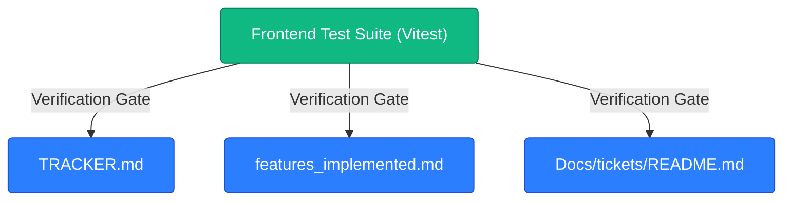

# TICKET-45: Automated Regression Suite & Persistent Memory Handoff

## Status
- **State**: ✅ Completed (Final Deliverable)
- **Primary Seams**: `TRACKER.md`, `features_implemented.md`, `Docs/tickets/README.md`
- **Verification**: Vitest 22/22 files, 134/134 tests — all green
- **Blocking Dependencies**: TICKET-43 (✅), TICKET-44 (✅)
- **Downstream Blocked**: None

---

## CodeGraph: Dependency, Callers & Blast Radius Analysis

### 1. Traced Callers & Full Regression Blast Radius
- All existing frontend studio tests must be executed to prevent unintended regressions:
  1. `frontend/__tests__/AgentSequenceTrack.test.tsx` (New Dedicated Suite)
  2. `frontend/__tests__/studio_console.test.tsx` (Console Integration)
  3. `frontend/__tests__/stage_progress_and_logs.test.tsx` (Stage Progress & Log Stream)
  4. `frontend/__tests__/demo_page_redesign.test.tsx` (Demo Page Drilldowns)
  5. `frontend/__tests__/skeleton_components.test.tsx` (Skeleton Loading States)

### 2. Blast Radius Assessment
- **Documentation & Memory Persistence**: Ensures subsequent AI agent sessions in fresh chats have full fidelity into the architectural choices, invariants (`inv_005`), and verified test outcomes without full-codebase rereading.

### 3. Type & File Seams
- `TRACKER.md` (Agent Handoff Log)
- `features_implemented.md` (Feature Registry)
- `Docs/tickets/README.md` (Tickets Index)

---

## Target Files & Commands
1. **Verification**:
   - `cd frontend && npx vitest run __tests__/AgentSequenceTrack.test.tsx`
   - `cd frontend && npm test`
2. **Project Memory Files**:
   - [`TRACKER.md`](file:///c:/CCodes_WebDevelopment/hckthon/localize_movie_dub/TRACKER.md)
   - [`features_implemented.md`](file:///c:/CCodes_WebDevelopment/hckthon/localize_movie_dub/features_implemented.md)
   - [`Docs/tickets/README.md`](file:///c:/CCodes_WebDevelopment/hckthon/localize_movie_dub/Docs/tickets/README.md)

---

## Acceptance Criteria
1. Full frontend test suite passes cleanly.
2. `TRACKER.md` contains an updated handoff entry documenting changes, files changed, verification results, and next agent instructions.
3. `features_implemented.md` records the Serpentine 2-Row Boustrophedon Workflow Route as `Implemented`.
