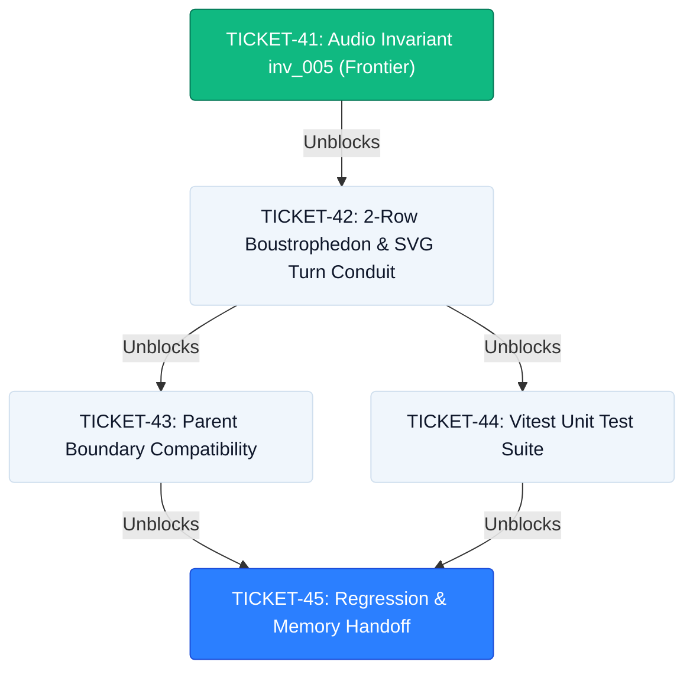

# WAYFINDER MAP: Restoring Serpentine Agent Workflow Route (2-Row Boustrophedon)

## Destination
Restore the 2-row boustrophedon (snake-flow) Serpentine Agent Workflow Route in `frontend/components/studio/AgentSequenceTrack.tsx`, replacing the 6-column grid with Row 1 (Left ➔ Right: Steps 01, 02, 03), an animated SVG downward turn conduit (`03 ➔ 04`), and Row 2 (Right ➔ Left: Steps 04 ⮌ 05 ⮌ 06), with 4px box geometry tokens and invariant `inv_005` (24kHz PCM_16).

---

## Notes & Constraints
- **Design System**: Light-Blue Mintlify (`#F0F6FC` canvas base, `#FFFFFF` card surface, `#D0DFEE` border, `#2B7FFF` Signal Blue).
- **Anti-Slop Rule**: Strictly zero pill buttons (`rounded-[4px]` for badges/buttons, `rounded-[16px]` for cards, `rounded-[24px]` for containers).
- **Domain Invariant**: `inv_005` (`24kHz PCM_16 WAV`).
- **Skills**: `/taste-skill`, `/animate`, `/10x-dev`, `/tdd`, `/wayfinder`.

---

## Ticket Dependency Graph

---

## Ticket Inventory

| Ticket ID | Title | Status | Primary Seam | Blocking Dependencies |
|---|---|---|---|---|
| [TICKET-41](./TICKET-41-voice-director-audio-invariant.md) | Voice Director Audio Invariant Metadata (`inv_005`) | **Frontier (Ready)** | `frontend/components/studio/AgentSequenceTrack.tsx` | None |
| [TICKET-42](./TICKET-42-boustrophedon-serpentine-grid-layout.md) | 2-Row Boustrophedon Grid Layout & SVG Turn Conduit | Blocked | `frontend/components/studio/AgentSequenceTrack.tsx` | TICKET-41 |
| [TICKET-43](./TICKET-43-parent-boundary-compatibility.md) | Parent Boundary Compatibility Check | Blocked | `frontend/app/runs/demo/page.tsx` | TICKET-42 |
| [TICKET-44](./TICKET-44-serpentine-track-unit-test-suite.md) | Serpentine Agent Sequence Track Unit Test Suite | Blocked | `frontend/__tests__/AgentSequenceTrack.test.tsx` | TICKET-42 |
| [TICKET-45](./TICKET-45-regression-and-memory-handoff.md) | Automated Regression Suite & Persistent Memory Handoff | Blocked | `TRACKER.md` & `features_implemented.md` | TICKET-43, TICKET-44 |
