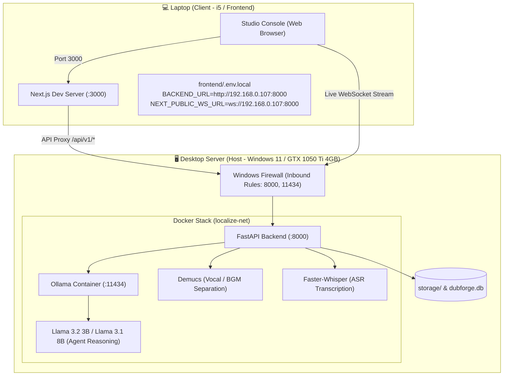

# LOCALIZE — Desktop Compute Server & Remote Laptop Setup Guide

This guide details how to turn this **Windows Desktop Machine** into a high-performance, private AI compute node ("Cloud Host") running **Docker + Ollama (Llama) + Demucs + Faster-Whisper**, and connect a **Developer Laptop (Client)** running the Next.js Studio UI over your local network.

---

## 🏗️ Architecture & Component Split



---

## 🧠 Hardware & VRAM Lifecycle Strategy (4GB GPU Envelope)

### The Sequential Execution Principle
Because the desktop host is equipped with an **NVIDIA GTX 1050 Ti (4096 MiB VRAM)**, simultaneous ML execution will exhaust GPU memory. The pipeline runs in **strictly sequential stages**:

```
[ Stage 1: Demucs Separation ] ──▶ Unload VRAM ──▶ [ Stage 2: Faster-Whisper ] ──▶ Unload VRAM ──▶ [ Stage 3: Ollama Llama Reasoning ] ──▶ Unload VRAM
       (~1.8 GB VRAM)                                    (~1.2 GB VRAM)                                      (~2.0 GB VRAM)
```

1. **Ollama Keep-Alive Zero**: `OLLAMA_KEEP_ALIVE=0` is set so the LLM automatically frees CUDA memory when reasoning finishes.
2. **Torch Garbage Collection**: PyTorch calls `torch.cuda.empty_cache()` between pipeline steps.
3. **Recommended Local LLM**: `llama3.2:3b` or `qwen2.5:3b` for fast, low-footprint reasoning, or `llama3.1:8b` (hybrid offload).

---

## 🚀 Part 1: Desktop Server Setup (Run Once on this Machine)

### Step 1: Open Inbound Windows Firewall Ports
Allow incoming connections from your laptop on ports `8000` (API/WebSocket) and `11434` (Ollama).

Open **PowerShell as Administrator** and execute:
```powershell
New-NetFirewallRule -DisplayName "LOCALIZE Backend API & WS" -Direction Inbound -LocalPort 8000 -Protocol TCP -Action Allow
New-NetFirewallRule -DisplayName "LOCALIZE Ollama Server" -Direction Inbound -LocalPort 11434 -Protocol TCP -Action Allow
```

> [!IMPORTANT]
> Ensure your Windows Network Profile is set to **Private** (`Settings > Network & internet > Properties > Private network`). Windows automatically drops inbound packets if set to Public.

---

### Step 2: Confirm Host IP Address
Find your desktop's current LAN IP address:
```powershell
Get-NetIPAddress -AddressFamily IPv4 | Where-Object {$_.InterfaceAlias -match 'Ethernet|Wi-Fi'} | Select-Object IPAddress, InterfaceAlias
```
*(Example output: `192.168.0.107`)*

---

### Step 3: Start the Docker Compute Stack
From the project root on the desktop, launch the backend and Ollama containers with GPU support:

```bash
# Standard Docker launch with GPU acceleration
docker compose -f docker-compose.yml -f docker-compose.gpu.yml up -d backend ollama
```

Check container status:
```bash
docker compose ps
```

---

### Step 4: Pull the Llama Model into Ollama
Download the Llama model directly into the persistent Ollama volume:

```bash
# Pull Llama 3.2 3B (Fast & fits cleanly in 4GB VRAM)
docker exec -it localize-ollama ollama pull llama3.2:3b

# Optional: Pull Llama 3.1 8B (Higher reasoning capacity)
docker exec -it localize-ollama ollama pull llama3.1:8b
```

Verify model availability:
```bash
docker exec -it localize-ollama ollama list
```

---

## 💻 Part 2: Laptop Client Setup (Run on your Laptop)

### Step 1: Pull Latest Code
On your laptop:
```bash
git pull origin main
cd frontend
npm ci
```

---

### Step 2: Configure `.env.local` on Laptop
Create `frontend/.env.local` on your laptop pointing to your Desktop's LAN IP:

```ini
# Replace 192.168.0.107 with your Desktop Server's IP address
BACKEND_URL=http://192.168.0.107:8000
NEXT_PUBLIC_WS_URL=ws://192.168.0.107:8000
PORT=3000
```

---

### Step 3: Start the Fast Next.js Frontend
```bash
npm run dev
```

Open your browser at **`http://localhost:3000`**. You now have the full Studio Console running locally on your laptop, offloading all ML jobs, models, and audio processing to your desktop GPU!

---

## 🩺 Part 3: Verification & Network Health Checks

### 1. Test Backend API from Laptop
Run from your laptop terminal:
```bash
curl http://192.168.0.107:8000/health
# Expected: {"status":"ok","app":"LOCALIZE Studio API","version":"1.0.0","environment":"production"}
```

### 2. Test Ollama Model Endpoint from Laptop
```bash
curl http://192.168.0.107:11434/api/tags
# Expected: JSON listing downloaded models (llama3.2:3b)
```

### 3. Test GPU Inference Inside Container
```bash
docker exec -it localize-backend python -c "import torch; print('CUDA available:', torch.cuda.is_available(), '| GPU:', torch.cuda.get_device_name(0) if torch.cuda.is_available() else 'None')"
```

---

## 🔧 Senior Troubleshooting Matrix

| Problem | Root Cause | Solution |
|---|---|---|
| **`Connection Refused` on Port 8000 from Laptop** | Windows Firewall blocking inbound traffic or network profile is "Public". | Set network to "Private" and run the PowerShell `New-NetFirewallRule` above. |
| **Live Logs / WebSocket stream says Disconnected** | `NEXT_PUBLIC_WS_URL` is missing on laptop `.env.local`, so the browser defaulted to `localhost:8000`. | Add `NEXT_PUBLIC_WS_URL=ws://192.168.0.107:8000` in `frontend/.env.local` and restart `npm run dev`. |
| **`CUDA out of memory` during Run** | Multiple models loaded at once or Ollama kept LLM in VRAM. | Verify `OLLAMA_KEEP_ALIVE=0` is set in `docker-compose.yml`. Use `llama3.2:3b` instead of 70B models. |
| **Desktop IP changes after router restart** | Router DHCP re-allocated IP. | Set a DHCP Static Reservation in your Wi-Fi router for the Desktop's MAC address. |
| **CORS errors in browser console** | Backend rejecting requests from laptop IP. | Ensure `CORS_ORIGINS=*` in root `.env` or specify `http://localhost:3000,http://<laptop-ip>:3000`. |
