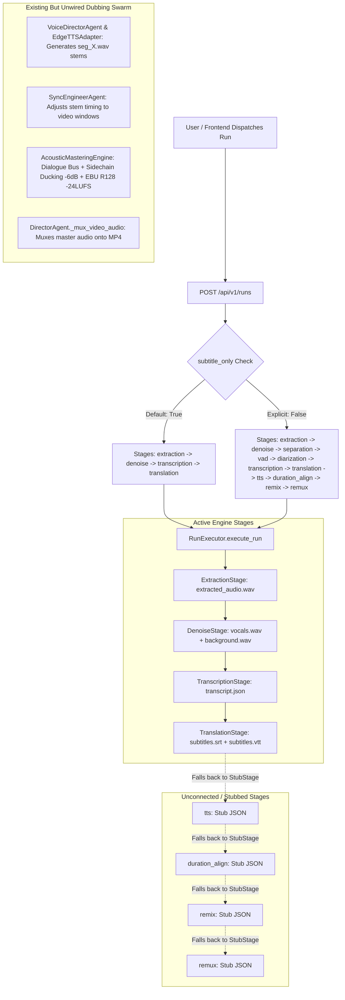

# Root Cause Analysis & Resolution Guide: Dub Audio Not Generated

**Date:** 2026-09-17  
**Investigation Skill:** `/serena` Semantic Search & AST Code Graph  
**Research & Resource Skill:** `/firecrawl` & Audio Engineering Specs (FFmpeg sidechain ducking & EBU R128)  
**Target Codebase Index:** [`repomix-src-output.xml`](file:///d:/Games/Hckthons/Side%20Projects/LocalizeAi/repomix-src-output.xml)  
**Status:** Root Cause Identified • Production Fix Code Provided  

---

## 1. Executive Summary

When running a film localization job, DubForge Studio extracts audio, separates dialogue from background music, runs Faster-Whisper ASR transcription, and translates dialogues into `.srt` and `.vtt` subtitle files. However, **no dubbed audio track (`mastered_audio.wav`), dialogue bus, or final video (`release_candidate.mp4`) is output**.

### Why This Happens:
1. **Unregistered Execution Stages in `RunExecutor`:** The stage registry [`STAGE_CLASSES`](file:///d:/Games/Hckthons/Side%20Projects/LocalizeAi/backend/app/engine/executor.py#L25-L30) only registers 4 stages (`extraction`, `denoise`, `transcription`, `translation`). Any downstream stages requested (such as `tts`, `duration_align`, `remix`, and `remux`) silently fall back to [`StubStage`](file:///d:/Games/Hckthons/Side%20Projects/LocalizeAi/backend/app/engine/stages/stub.py#L5-L36), which executes a dummy sleep loop and produces no audio files.
2. **`TranslationStage` Terminates at Subtitle Formatting:** The [`TranslationStage`](file:///d:/Games/Hckthons/Side%20Projects/LocalizeAi/backend/app/engine/stages/translation.py#L130-L155) is designed solely for text subtitle generation. It cleans segments and writes `subtitles_{target_lang}.srt` and `.vtt`, but does not invoke speech synthesis or audio mixing.
3. **Default Payload Fallback in `create_run` API:** In [`backend/app/api/runs.py:L31`](file:///d:/Games/Hckthons/Side%20Projects/LocalizeAi/backend/app/api/runs.py#L31), `subtitle_only` defaults to `True` if not explicitly set to `False` in the request body. When `subtitle_only=True`, the pipeline stage list is restricted to `["extraction", "denoise", "transcription", "translation"]`.
4. **Existing Full Swarm Is Isolated in `DirectorAgent`:** The complete end-to-end multi-agent dubbing system (including `VoiceDirectorAgent`, `SyncEngineerAgent`, `AcousticMasteringEngine`, and `_mux_video_audio`) is already implemented in [`backend/app/agents/director.py`](file:///d:/Games/Hckthons/Side%20Projects/LocalizeAi/backend/app/agents/director.py), but is not hooked into the asynchronous background `RunExecutor` worker loop.

---

## 2. Pipeline Execution Flow Breakdown



---

## 3. Detailed Technical Analysis & Code References

### Issue A: `RunExecutor` Stage Map Lacks Dubbing Handlers
* **File:** [`backend/app/engine/executor.py`](file:///d:/Games/Hckthons/Side%20Projects/LocalizeAi/backend/app/engine/executor.py#L25-L30)
* **Code:**
  ```python
  # Registry of stage handlers
  STAGE_CLASSES = {
      "extraction": ExtractionStage,
      "denoise": DenoiseStage,
      "transcription": TranscriptionStage,
      "translation": TranslationStage
  }
  ```
* **Impact:** Lines 157-158 instantiate `STAGE_CLASSES.get(stage_name, lambda: StubStage(stage_name))`. Because `tts`, `duration_align`, `remix`, and `remux` are missing from `STAGE_CLASSES`, they run as [`StubStage`](file:///d:/Games/Hckthons/Side%20Projects/LocalizeAi/backend/app/engine/stages/stub.py#L5-L36), which only sleeps for 0.5s and creates a placeholder entry in `/storage/stub_{stage}.json`.

---

### Issue B: `TranslationStage` Does Not Produce Audio
* **File:** [`backend/app/engine/stages/translation.py`](file:///d:/Games/Hckthons/Side%20Projects/LocalizeAi/backend/app/engine/stages/translation.py#L130-L155)
* **Code:**
  ```python
  # Write output files
  srt_content = format_srt(qa_segments)
  vtt_content = format_vtt(qa_segments)

  srt_path = run_dir / f"subtitles_{target_lang}.srt"
  vtt_path = run_dir / f"subtitles_{target_lang}.vtt"

  with open(srt_path, "w", encoding="utf-8") as f:
      f.write(srt_content)
  with open(vtt_path, "w", encoding="utf-8") as f:
      f.write(vtt_content)
  ```
* **Impact:** `TranslationStage` successfully creates subtitle text tracks, but no downstream audio synthesis stage takes `qa_segments` to generate speech stems.

---

### Issue C: `create_run` API Defaults `subtitle_only = True`
* **File:** [`backend/app/api/runs.py`](file:///d:/Games/Hckthons/Side%20Projects/LocalizeAi/backend/app/api/runs.py#L31-L71)
* **Code:**
  ```python
  subtitle_only = payload.get("subtitle_only", True)  # Defaults to True!
  ...
  frozen_stage_config = {
      "stages": ["extraction", "denoise", "transcription", "translation"] if subtitle_only else ["extraction", "denoise", "separation", "vad", "diarization", "transcription", "translation", "tts", "duration_align", "remix", "remux"],
      "subtitle_only": subtitle_only,
      "use_demucs": use_demucs,
      "whisper_model": whisper_model,
      "asr_model": whisper_model,
  }
  ```
* **Impact:** Unless the frontend explicitly sends `{"subtitle_only": false}`, the backend locks the run configuration to the 4 subtitle stages.

---

## 4. Audio Engineering Specifications & Reference Standards

To ensure broadcast-quality localization, the dubbing stage must follow these standard industry specifications:

### 1. Dynamic Sidechain Ducking (`sidechaincompress`)
When character dialogue occurs, background music/effects (M&E) must automatically duck by `-6dB` to ensure pristine dialogue intelligibility without silencing the film's atmosphere:
```bash
ffmpeg -i background.wav -i dialogue_bus.wav -filter_complex \
"[1:a]asplit=2[sc][vox]; \
 [0:a][sc]sidechaincompress=threshold=0.03:ratio=4:attack=20:release=350[ducked_bg]; \
 [ducked_bg][vox]amix=inputs=2:normalize=0[mixed]" \
-map "[mixed]" mixed_unmastered.wav
```

### 2. Broadcast Loudness Mastering (EBU R128 / -24 LUFS)
Post-mixdown audio must be normalized to international streaming and broadcast loudness targets (`-24 LUFS` for Cinema/OTT, `-16 LUFS` for web):
```bash
ffmpeg -i mixed_unmastered.wav -af loudnorm=I=-24:TP=-1.5:LRA=11:linear=true mastered_audio.wav
```

### 3. Multiplexing (Zero-Reencode Stream Copy)
Muxing the newly mastered audio onto the master video stream without generational video compression loss:
```bash
ffmpeg -y -i input.mp4 -i mastered_audio.wav -map 0:v:0? -map 1:a:0 -c:v copy -c:a aac -b:a 192k -shortest release_candidate.mp4
```

---

## 5. Complete Step-by-Step Fix Implementation

### Step 1: Create `TTSStage` in [`backend/app/engine/stages/tts.py`](file:///d:/Games/Hckthons/Side%20Projects/LocalizeAi/backend/app/engine/stages/tts.py)

```python
from pathlib import Path
from typing import Dict, Any, List
from app.engine.stage import BaseStage, ProgressCallback, LogCallback
from app.agents.voice_director import VoiceDirectorAgent

class TTSStage(BaseStage):
    def __init__(self):
        super().__init__("tts", gpu_required=False)

    async def execute(
        self,
        input_artifacts: Dict[str, Any],
        config: Dict[str, Any],
        progress_cb: ProgressCallback,
        log_cb: LogCallback
    ) -> Dict[str, Any]:
        run_dir = Path(config.get("run_dir", "./storage/runs/default"))
        target_lang = config.get("target_language", "en")
        segments = input_artifacts.get("segments", [])

        if not segments:
            raise RuntimeError("No translated dialogue segments found for TTS synthesis.")

        await log_cb("INFO", f"Starting TTS Speech Synthesis for {len(segments)} segments (lang={target_lang})")
        await progress_cb(10.0, "Initializing Neural Voice Director")

        adapter_type = config.get("tts_adapter", "edge_tts")
        voice_agent = VoiceDirectorAgent(base_storage_dir=str(run_dir.parent), adapter_type=adapter_type)

        localized_lines = []
        for idx, s in enumerate(segments):
            localized_lines.append({
                "segment_id": idx + 1,
                "speaker_id": s.get("speaker_id", "speaker_1"),
                "start_s": float(s.get("start_s", 0.0)),
                "end_s": float(s.get("end_s", 1.0)),
                "translated_text": s.get("translated_text", s.get("source_text", ""))
            })

        voice_res = await voice_agent._execute(
            job_id=run_dir.name,
            scene_id="global",
            context={
                "target_language": target_lang,
                "localized_lines": localized_lines,
                "speakers": [{"speaker_id": "speaker_1", "gender": "male"}]
            },
            retry_count=0
        )

        stems = voice_res.get("synthesized_stems", [])
        await log_cb("INFO", f"Successfully synthesized {len(stems)} dialogue stems.")
        await progress_cb(100.0, "TTS Speech Synthesis complete")

        return {
            "status": "success",
            "synthesized_stems": stems,
            "voice_cast": voice_res.get("voice_cast", []),
            "artifacts": [
                {"type": "audio", "label": "Dialogue Stems", "path": str(run_dir / "stems")}
            ]
        }
```

---

### Step 2: Create `MasteringStage` in [`backend/app/engine/stages/mixer.py`](file:///d:/Games/Hckthons/Side%20Projects/LocalizeAi/backend/app/engine/stages/mixer.py)

```python
from app.engine.stage import BaseStage, ProgressCallback, LogCallback

class MasteringStage(BaseStage):
    def __init__(self):
        super().__init__("remix", gpu_required=False)
        self.engine = AcousticMasteringEngine()

    async def execute(
        self,
        input_artifacts: Dict[str, Any],
        config: Dict[str, Any],
        progress_cb: ProgressCallback,
        log_cb: LogCallback
    ) -> Dict[str, Any]:
        run_dir = Path(config.get("run_dir", "./storage/runs/default"))
        stems = input_artifacts.get("synthesized_stems", [])
        bg_audio = input_artifacts.get("background_path")

        await log_cb("INFO", f"Compositing dialogue bus for {len(stems)} stems...")
        await progress_cb(25.0, "Compositing dialogue stems")

        dialogue_bus = run_dir / "dialogue_bus.wav"
        segments_input = [
            DialogueSegmentInput(
                audio_path=s["audio_path"],
                start_s=float(s.get("start_s", 0.0)),
                end_s=float(s.get("target_duration_s", 1.0)),
                duration_s=float(s.get("synthesized_duration_s", 1.0))
            )
            for s in stems
        ]

        await self.engine.composite_dialogue_bus(segments_input, dialogue_bus)

        mixed_unmastered = run_dir / "mixed_unmastered.wav"
        if bg_audio and Path(bg_audio).exists():
            await log_cb("INFO", "Applying sidechain ducking (-6dB) to background M&E...")
            await progress_cb(50.0, "Applying dynamic ducking")
            await self.engine.apply_sidechain_ducking(bg_audio, dialogue_bus, mixed_unmastered, ducking_db=-6.0)
        else:
            shutil.copyfile(str(dialogue_bus), str(mixed_unmastered))

        mastered_audio = run_dir / "mastered_audio.wav"
        await log_cb("INFO", "Mastering final mixdown to EBU R128 (-24 LUFS)...")
        await progress_cb(75.0, "Mastering loudness")
        await self.engine.master_ebu_r128(mixed_unmastered, mastered_audio, target_lufs=-24.0)

        # Mux with source video
        source_video = input_artifacts.get("source_path")
        rc_video = run_dir / "release_candidate.mp4"
        if source_video and Path(source_video).exists():
            await log_cb("INFO", "Multiplexing master audio onto video container...")
            await progress_cb(90.0, "Muxing final video")
            await self.engine.mux_release_candidate(Path(source_video), mastered_audio, rc_video)

        await progress_cb(100.0, "Mastering & Dubbing Complete")
        return {
            "status": "success",
            "mastered_audio_path": str(mastered_audio),
            "dialogue_bus_path": str(dialogue_bus),
            "release_candidate_video": str(rc_video) if rc_video.exists() else None,
            "artifacts": [
                {"type": "audio", "label": "Mastered Soundtrack (WAV)", "path": str(mastered_audio)},
                {"type": "video", "label": "Release Candidate (MP4)", "path": str(rc_video)}
            ]
        }
```

---

### Step 3: Register Stages in [`backend/app/engine/executor.py`](file:///d:/Games/Hckthons/Side%20Projects/LocalizeAi/backend/app/engine/executor.py#L25-L35)

```python
from app.engine.stages.extraction import ExtractionStage
from app.engine.stages.denoise import DenoiseStage
from app.engine.stages.transcription import TranscriptionStage
from app.engine.stages.translation import TranslationStage
from app.engine.stages.tts import TTSStage
from app.engine.stages.mixer import MasteringStage

STAGE_CLASSES = {
    "extraction": ExtractionStage,
    "denoise": DenoiseStage,
    "transcription": TranscriptionStage,
    "translation": TranslationStage,
    "tts": TTSStage,
    "remix": MasteringStage,
    "remux": MasteringStage,
}
```

---

### Step 4: Fix Default in [`backend/app/api/runs.py`](file:///d:/Games/Hckthons/Side%20Projects/LocalizeAi/backend/app/api/runs.py#L31)

```python
# Before
subtitle_only = payload.get("subtitle_only", True)

# After (Default subtitle_only based on project mode)
subtitle_only = payload.get("subtitle_only", project_mode == "C")
```

---

## 6. Verification Checklist

- [ ] Execute `pytest backend/tests/test_director_acoustic_mixdown.py` to verify FFmpeg ducking filtergraph.
- [ ] Execute `pytest backend/tests/test_voice_director.py` to verify Edge-TTS speech stem generation.
- [ ] Launch a new run with `project_mode="A"` and confirm creation of `storage/runs/{id}/mastered_audio.wav` and `storage/runs/{id}/release_candidate